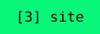
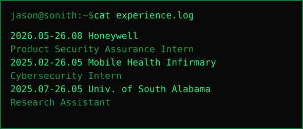
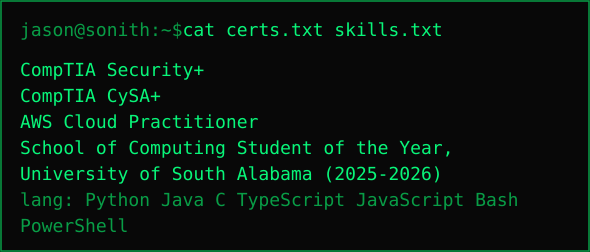

<!-- Generated by jasonsonith.github.io/scripts/readme. Edit src/data/profile.ts, then run npm run readme. -->

  

  
  
  
  

  
  

### `cat experience.log --verbose`

- **Product Security Assurance Intern**, Honeywell (May-Aug 2026)
  - Tested firmware, web applications, and software for security vulnerabilities; assessed risk across product lines.
  - Used Nmap, Burp Suite, OWASP ZAP, and Gobuster to enumerate services and test web applications.
  - Documented findings and remediation recommendations for developers; validated fixes with product teams.
- **Cybersecurity Intern**, Mobile Health Infirmary (Feb 2025-May 2026)
  - Monitored network activity for vulnerabilities, supported system hardening, and resolved staff access issues.
  - Developed and implemented a NIST-aligned incident response playbook defining severity levels, response roles, evidence handling, and recovery validation to support HIPAA/HITECH requirements.
  - Supported migration of on-premises systems to AWS.
- **Research Assistant, Earthquake Prediction**, University of South Alabama (Jul 2025-May 2026)
  - Co-authored "Early Warning of Earthquakes from Broadband Seismic Streams with NLPSA", applying nonlinear phase space analysis to earthquake early warning.
  - Built a Python pipeline (ObsPy, pandas, NumPy, SciPy) that pulls three-component broadband data from IRIS station IU.ANMO and labels P-wave, S-wave, and coda arrivals with TauP on the IASP91 model.
  - Ran a Monte Carlo sweep of 284 NLPSA parameter sets over ten regional earthquakes (M5.7-7.0) and three non-event windows; 65.5% separated every event window from every non-event window.

### `ls -la ~/projects`

| project | what | stack |
|---|---|---|
| **Engineering Skills Assessment Platform** | Browser-based CAD platform for practical engineering assessments. | TypeScript, WebAssembly, Python, FastAPI |
| [OSCP Penetration Testing Labs](https://github.com/JasonSonith/OSCP) | Hands-on offensive practice while preparing for the OSCP. | Linux, Nmap, Burp Suite, Metasploit |
| [Nextcloud Security Assessment Lab](https://github.com/JasonSonith/Team-7-nextcloud-security-lab) | Docker lab with nginx, TLS, and MariaDB, attacked to assess a self-hosted Nextcloud. | Docker, nginx, MariaDB, Burp Suite, OWASP ZAP, Nmap |
| **Multi-Agent AI Medical Device Validation Platform** | Python pipeline that scrapes manufacturer sites and validates device data against the FDA GUDID database. | Python, bcrypt, RBAC, OWASP ZAP |
| [Seismic Early Warning with NLPSA](https://github.com/JasonSonith/Earthquake-prediction) | Earthquake early warning from broadband seismic streams using nonlinear phase space analysis instead of deep learning pickers. | Python, ObsPy, NumPy, SciPy, Java |
| [pfSense IDS/IPS Lab](https://github.com/JasonSonith/pfsense-ids-ips-lab) | Small enterprise network simulation with Kali Linux as the attacker and pfSense providing IDS/IPS. | pfSense, Kali Linux, Ubuntu |
| [python-log-analyzer](https://github.com/JasonSonith/python-log-analyzer) | Script that analyzes JSON logs and flags suspicious events. | Python |

### `cat certs.txt`

- CompTIA Security+
- CompTIA CySA+
- AWS Cloud Practitioner
- School of Computing Student of the Year, University of South Alabama (2025-2026)

### `cat skills.txt`

- **security**: Burp Suite, Nmap, OWASP ZAP, Metasploit, Gobuster, Splunk, Nessus, pfSense, WireGuard, Kali Linux
- **cloud**: AWS IAM, EC2, S3, GuardDuty, CloudTrail, Config, Linux, Docker
- **languages**: Python, Java, C, TypeScript, JavaScript, Bash, PowerShell

### `cat education.txt`

- **Georgia Institute of Technology**: M.S. Information Security (Expected May 2028)
- **University of South Alabama**: B.S. Computer Science, Cybersecurity Concentration (2022-2026), GPA 3.9, summa cum laude

### `history | grep leadership`

- **Member**, GreyHat (Aug 2026-now): Competed in TNC26 CTF, solving web vulnerability challenges by crafting payloads to escalate privileges and capture flags.
- **Student Government Senator**, University of South Alabama (Mar 2025-May 2026): Started a School of Computing hackathon and passed legislation securing $6,000 for computing events.
- **President, Video Game Development Club**, University of South Alabama (Fall 2024-May 2026): Revived an inactive club and rebuilt member engagement.
